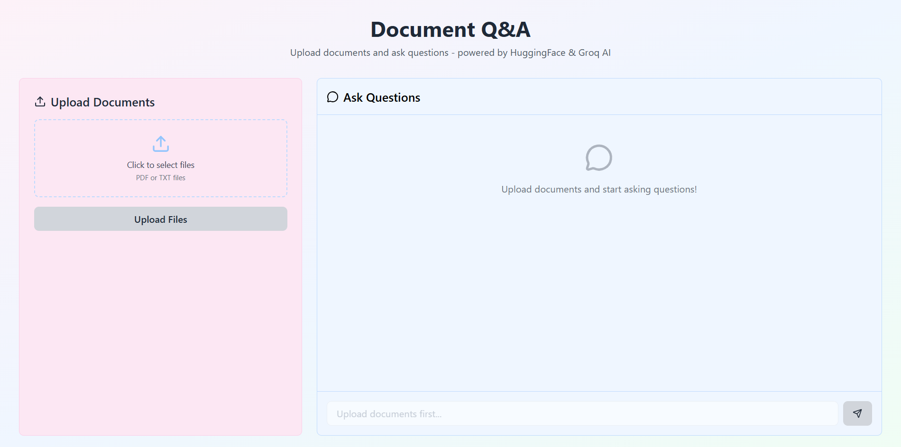
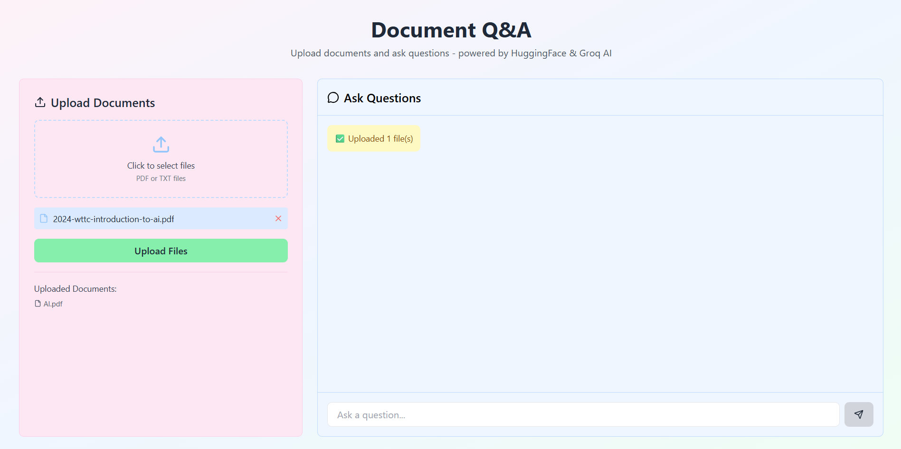
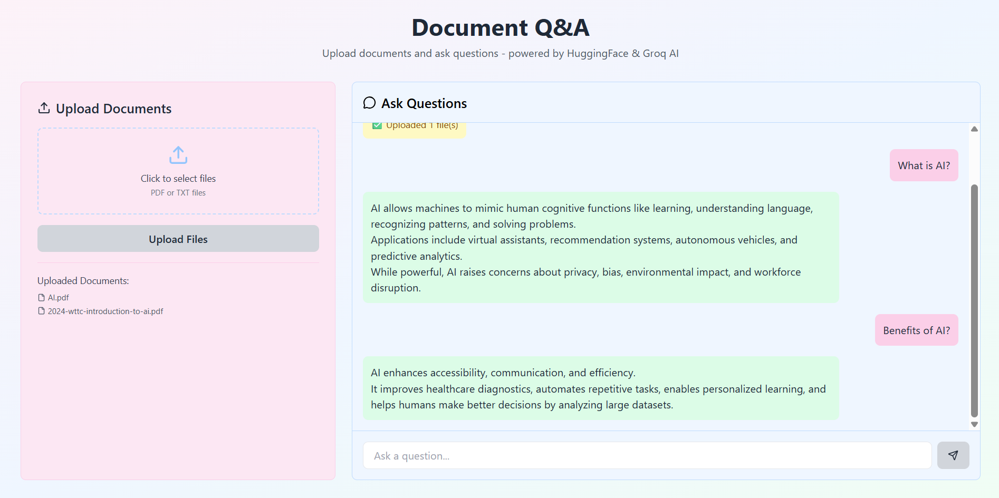

# Knowledge Base Search

A **smart document search system** built using **MERN stack** with **AI-powered question answering**.  
Upload your documents, ask questions, and get **context-aware answers with sources** — fast and easy.

---

## Demo Video

Watch the full demo of **Knowledge Base Search**: [Google Drive Link]

https://drive.google.com/file/d/1gYD-o7wN2qv5Cio1TdSnLjSuUs7WiTs8/view?usp=drivesdk

---

## Overview

**Knowledge Base Search** lets you:

- Upload PDFs or text files  
- Extract and chunk content automatically  
- Create embeddings for semantic understanding  
- Ask natural language questions  
- Get answers with **document references**  

It’s like having an **AI-powered Google** for your own documents.

---

## Tech Stack

| Layer       | Technology                     |
|------------|-------------------------------|
| Frontend   | React (Vite)                  |
| Backend    | Node.js + Express             |
| Database   | MongoDB                       |
| AI Layer   | HuggingFace Embeddings + Groq API |

---

## Key Features

- Multi-document upload  
- Automatic text chunking  
- Semantic search via embeddings  
- Natural language Q&A  
- Answers with source references  
- Smooth UI with React + Axios  

---

## How It Works (Simple)

1. **Upload Documents** – text is extracted & split into chunks.  
2. **Store in Database** – chunks & embeddings are saved in MongoDB.  
3. **Ask Questions** – question converted to embeddings, compared with stored chunks.  
4. **Get Answers** – top chunks sent to AI, answer returned with source references.  

---

## ⚡ Setup Instructions

### Backend
```bash
cd backend
npm install
````

Create a `.env` file with:

```env
MONGO_URI=your_mongo_connection_string
HUGGINGFACE_API_KEY=your_huggingface_api_key
GROQ_API_KEY=your_groq_api_key
PORT=5000
```

Run the backend:

```bash
node server.js
```

### Frontend

```bash
cd frontend
npm install
npm run dev
```

Open [http://localhost:5173](http://localhost:5173)

---

## Concepts Explained

| Term              | Meaning                                          |
| ----------------- | ------------------------------------------------ |
| Chunking          | Splitting long text into smaller pieces          |
| Embeddings        | Numeric representation of text meaning           |
| Cosine Similarity | Measures similarity between embeddings           |
| Groq API          | AI model that generates answers based on context |

---


## Preview

Here are some screenshots of the app in action:





---

## About Me

Hi! I’m **Khushi Kashyap** 👋
I love **AI, web development, and building intuitive apps**.
This project combines my passion for **full-stack development + machine learning**.

---
